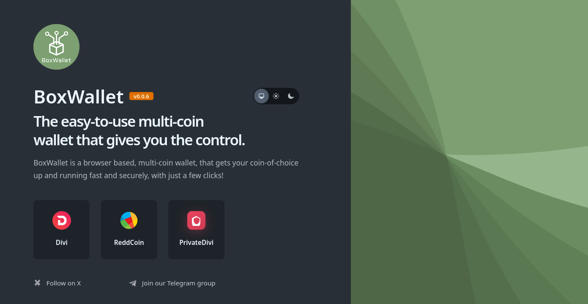
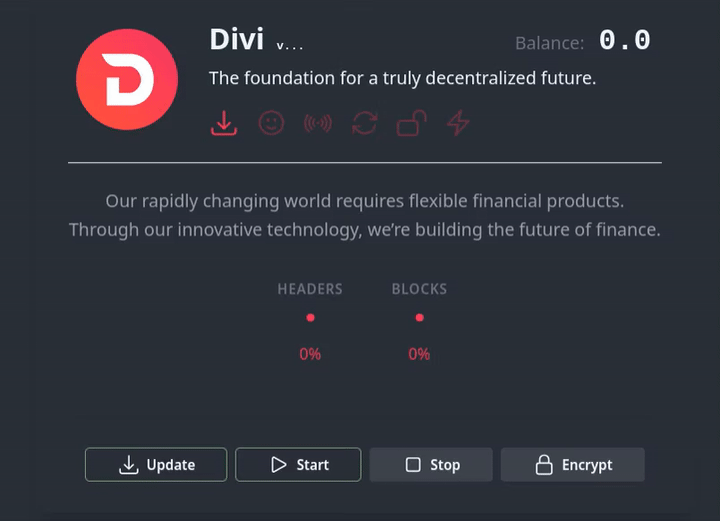
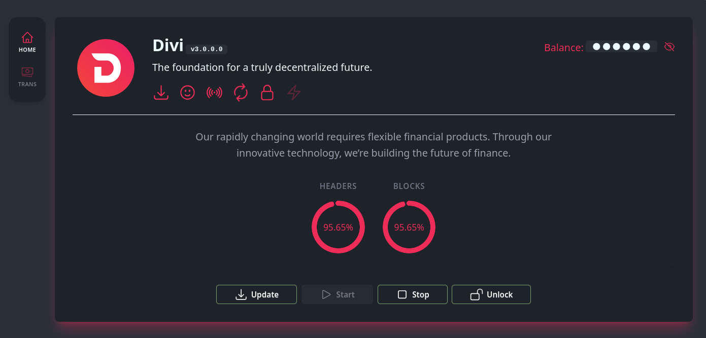
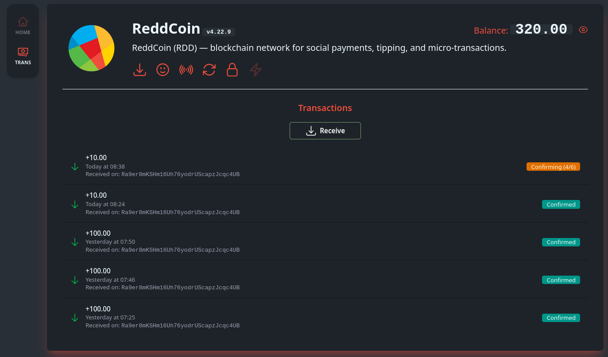

# What is BoxWallet 2?

BoxWallet 2 is a browser based, multi-coin wallet, that gets your coin-of-choice up and running fast and securely staking with just a few clicks. Pre-built binaries are available for Linux (x64, ARM64), macOS (Intel, Apple Silicon), and Windows — just download and run from the [releases page](https://github.com/richardltc/boxwallet2/releases/latest).

Starting the Divi wallet.

The Divi dashboard, nearly fully synced ready for staking:

The ReddCoin dashboard, displaying recent transactions:

If you prefer to do things manually, you can do so by following the instructions below...

Building from Source

## Building from Source

If you prefer to build from source, or if a pre-built release isn't available for your platform, follow the instructions below.

## Installing on Ubuntu 24.04

`sudo apt update && sudo apt install git inotify-tools automake autoconf libssl-dev libncurses-dev`

Now, we need to install a tool called `mise` which will handle the Erlang and Elixir install for us.

Copy and paste and run these lines one after the other, making sure you put your actual user name in the second line:

`curl https://mise.run | sh`

`echo "eval \"\$(/home/your_user_name/.local/bin/mise activate bash)\"" >> ~/.bashrc`

Now, re-start you shell and let's check we're OK so far and run `mise docter` which should report No problems found

`mise use erlang@26.2.5.15` this could take some time...

`mise use elixir@1.15.8-otp-26`

Please continue to *Installing BoxWallet2* below.

## Installing on Debian 13 (trixie) and Raspberry Pi OS (64 bit only)

`sudo update` - To update your local package dbase

`sudo apt install libc6:armhf libgcc-s1:armhf libstdc++6:armhf` - To install packages that Divi requires

`sudo apt install elixir erlang-dev erlang-xmerl erlang-syntax-tools git` - To install packages that BoxWallet requires.

Please continue to ***Installing BoxWallet2*** below.

## Install on Windows (WSL)

To install Ubuntu using WSL, open PowerShell as an administrator and run the command `wsl --install`, then restart your computer when prompted.
This command installs the Windows Subsystem for Linux and automatically downloads and installs the default Ubuntu distribution.

Now, please follow the ***Installing on Ubuntu 24.04*** instructions above, and then continue below.

## Installing BoxWallet2

Now that you have everything you need, change to a directory that you'd like to install BoxWallet, then run:

`git clone https://github.com/richardltc/boxwallet2.git`

Then, change into the directory:

`cd boxwallet2`

We're nearly there. :)
We now need to get all the last remaining dependencies, which we do by running `mix deps.get`

After this step is complete, you're now ready to run BoxWallet. Running the command `mix phx.server` will start the web server which enables you to point your browser to `http://localhost:4000`

By default, you'll only be able to access on your local box. If you'd like to run the server on a separate box, such as a Raspberry Pi, please change the ip address in the file: `config\dev.exs` from `127, 0, 0, 1` to `0.0.0.0` and re-start the `mix phx.server`

Congratulations, and thank you for using BoxWallet :)

